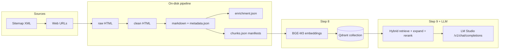
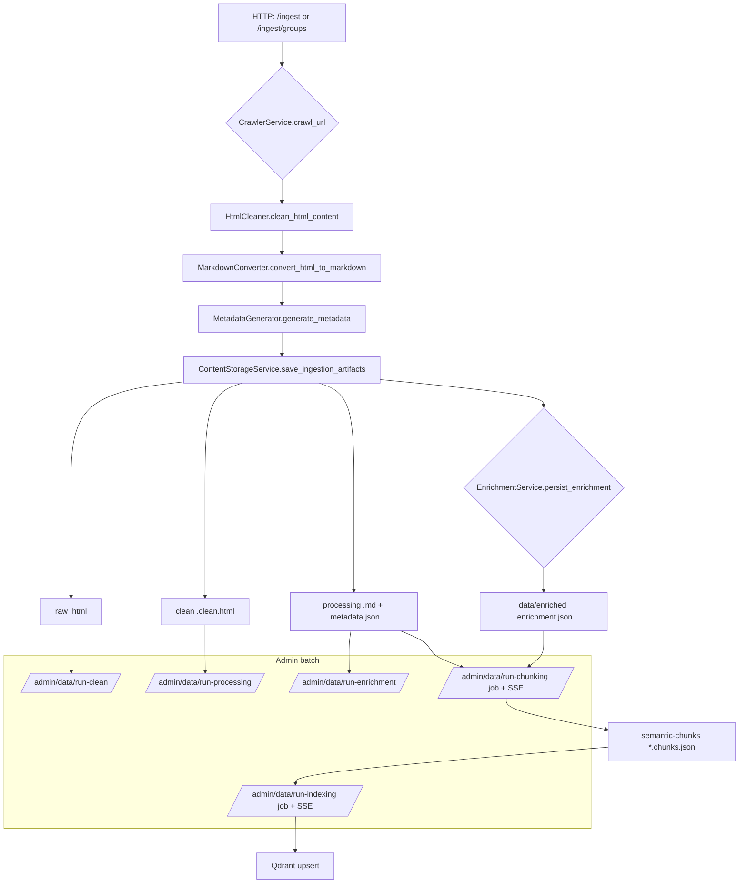
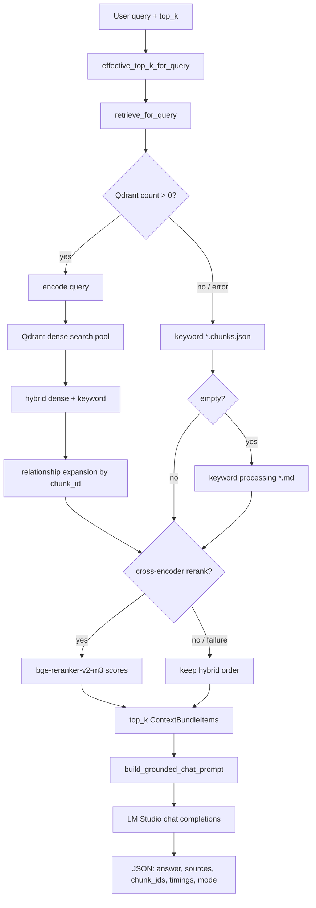

# Backend Technical Documentation

This document describes the **GenericRAG** backend: what has been implemented, how data flows from crawl to vector index, how chat retrieval and generation work, and how behaviour is controlled through configuration.

---

## 1. Scope and stack

The backend is a **FastAPI** application (`backend/app.py`) that provides:

- **Ingestion**: crawl web pages, normalize HTML, convert to markdown, generate metadata, optional LLM enrichment, semantic chunking, dense embedding, and upsert into **Qdrant**.
- **Retrieval and chat (MiniRAG)**: hybrid dense + keyword scoring over a vector candidate pool, relationship-aware expansion, **cross-encoder reranking**, then **grounded** answer generation via an **OpenAI-compatible** local server (**LM Studio**).
- **Operations**: health checks, data directory status, admin steps to re-run cleaning / processing / enrichment / chunking / indexing, optional evaluation over the same chat path.

Core libraries and services include **sentence-transformers** (BGE-M3 embeddings), **Qdrant** (cosine dense vectors), **httpx** (LM Studio and Qdrant REST health), and **Pydantic** for validated chunk and enrichment schemas.

---

## 2. Repository layout (backend)

| Area | Path | Role |
|------|------|------|
| API | `backend/api/routes.py` | HTTP endpoints; thin orchestration |
| Settings | `backend/settings.py` | Environment-backed `Settings` dataclass; HF cache pinning |
| Config helpers | `backend/config.py` | Bind address, Qdrant URL |
| Crawler | `backend/crawler/` | HTTP fetch; sitemap discovery and URL grouping |
| Ingestion | `backend/ingestion/` | HTML clean, markdown, metadata, enrichment, semantic chunking, indexing |
| Embeddings | `backend/embeddings/embedding_service.py` | BGE-M3 encode; warmup |
| Vector DB | `backend/vectordb/qdrant_service.py` | Collection lifecycle, search, retrieve by id |
| Reranker | `backend/reranker/reranker_service.py` | Cross-encoder scores |
| RAG | `backend/rag/` | Retrieval orchestration, context bundles, MiniRAG chat |
| LLM | `backend/llm/qwen_service.py` | LM Studio chat completions (name is historical) |
| Prompts | `backend/prompts/` | Grounded chat and enrichment prompts |
| Evaluation | `backend/evaluation/eval_service.py` | Batch runs over `MiniRagService.chat` |
| Logging | `backend/utils/logger.py` | Structured application logging |

On-disk pipeline artifacts live under configurable directories (defaults relative to project root), for example `backend/data/raw` through `backend/data/semantic-chunks`.

---

## 3. End-to-end system view

The following diagram ties together **ingestion**, **indexing**, and **chat**.

---

## 4. Ingestion pipeline (detailed)

### 4.1 Single-URL and batch flows

- **`POST /ingest`**: crawl one URL → clean → markdown → metadata → persist under `DATA_*` dirs → attempt enrichment write.
- **`POST /sitemap/load`**: discover URLs from a sitemap URL and return **grouped** URL sets for UI selection.
- **`POST /ingest/groups`**: resolve selected groups or explicit URLs, then run the same per-URL pipeline with **per-URL fault tolerance** (failures collected in the response).

Optional **`skip_scrape_if_exists`**: if artifacts for the URL already exist, the crawl step is skipped.

### 4.2 Step-by-step processing

| Step | Responsibility | Primary modules / endpoints |
|------|----------------|----------------------------|
| Crawl | Fetch HTML, record status and title | `CrawlerService`, `/crawl`, ingest |
| Clean | Strip boilerplate / normalize HTML for conversion | `HtmlCleaner`, `/admin/data/run-clean` |
| Markdown | HTML → markdown; deterministic structure | `MarkdownConverter`, `/admin/data/run-processing` |
| Metadata | Page-level metadata JSON alongside markdown | `MetadataGenerator` |
| Enrichment (Step 6) | LLM JSON: summaries, tags, entities, relationships, etc. | `EnrichmentService`, `/admin/data/run-enrichment`; also triggered from ingest / processing when configured |
| Semantic chunking (Step 7) | Section-aware chunks + stable `chunk_id`s + optional graph edges | `semantic_chunker.build_chunk_manifest`, background job via `/admin/data/run-chunking` |
| Indexing (Step 8) | Embed chunk text; upsert vectors + rich payloads | `indexing_service`, `/admin/data/run-indexing` |

**Chunk manifests** (`ChunkManifest` in `chunk_schema.py`) store `document_id`, `source_url`, `title`, versioned `chunking_policy`, per-chunk `section_title`, `text`, and `relationships` (including `target_chunk_id` for Qdrant expansion).

### 4.3 Ingestion Mermaid diagram

Chunking jobs and indexing jobs run in **background threads** with **SSE** progress endpoints (`/admin/data/chunking-events/{job_id}`, `/admin/data/indexing-events/{job_id}`). Job state is **in-memory** and is cleared on API reload.

---

## 5. Retrieval and chat pipeline (Step 9)

### 5.1 Overview

`MiniRagService.chat` (`minirag_service.py`):

1. Computes **effective `top_k`** (listing-style queries can be boosted up to `RETRIEVAL_LISTING_QUERY_TOP_K`, capped by `RETRIEVAL_RERANK_INPUT_MAX`).
2. Calls `retrieve_for_query` (`retrieval_service.py`).
3. Builds a **grounded** prompt via `build_grounded_chat_prompt` (`prompts/prompts.py`).
4. Calls `QwenService.generate_chat_response` → LM Studio.

### 5.2 Retrieval logic (`retrieve_for_query`)

When Qdrant has points:

1. **Embed** the user query with the same embedding model as indexing.
2. **Dense search** in Qdrant with limit `RETRIEVAL_VECTOR_POOL_SIZE`.
3. **Hybrid score**: normalize dense scores and keyword overlap on chunk text + section title; combine with weight `RETRIEVAL_HYBRID_KEYWORD_WEIGHT`.
4. **Relationship expansion**: from the top `RETRIEVAL_RERANK_POOL_SIZE` hybrid hits, follow payload `relationships[].target_chunk_id` (up to `RETRIEVAL_RELATIONSHIP_EXPAND_MAX`), fetching payloads by id from Qdrant.
5. Sort by hybrid score, take up to **`max(top_k, RETRIEVAL_RERANK_INPUT_MAX)`** candidates for the cross-encoder (see `_rerank_input_cap`).
6. **Rerank** with `BAAI/bge-reranker-v2-m3` when `RETRIEVAL_ENABLE_RERANKER` is true; on failure, order stays hybrid-based.
7. Return top `top_k` **ContextBundleItem** rows (chunk id, URL, section, text, scores).

**Fallbacks** (no points, empty hits, or vector-path errors): keyword scoring over `*.chunks.json` on disk; if still empty, legacy keyword scan over `data/processing/*.md` by markdown headings.

### 5.3 Chat / retrieval Mermaid diagram

### 5.4 Chat response shape (selected fields)

The `/chat` handler returns JSON including: `answer`, `retrieval_top_k_used`, `retrieved_count`, `sources`, `chunk_ids`, `retrieval_mode`, optional confidence inputs, and `performance` timings. When `RETRIEVAL_INCLUDE_TRACE_IN_RESPONSE` is true, **pre/post rerank traces** and serialized context bundles may be included (verbose).

---

## 6. Application lifecycle and concurrency

- **Startup** (`FastAPI` lifespan): if `EMBEDDING_WARMUP_ON_STARTUP` is true, `embedding_service.warmup()` runs in a **thread pool** so the event loop is not blocked (snapshot verify, model load, one encode).
- **`/chat` and `/evaluation/run`**: CPU/GPU-bound work is executed via **`run_in_threadpool`** from the async route handlers.
- **CORS** is enabled for local Vite dev origins (`localhost:5173`).

Environment defaults for Hugging Face behaviour are set early in `app.py` (for example progress bar suppression).

---

## 7. Configuration reference

All tunables are loaded in `backend/settings.py` from environment variables (with defaults). The canonical list and commentary live in `backend/.env.example`. Below, names are grouped by concern.

### 7.1 Application and HTTP

| Variable | Purpose |
|----------|---------|
| `APP_NAME` | FastAPI title |
| `APP_ENV` | Environment label |
| `APP_HOST`, `APP_PORT` | Server bind |
| `LOG_LEVEL` | Logging verbosity |

### 7.2 Qdrant

| Variable | Purpose |
|----------|---------|
| `QDRANT_HOST`, `QDRANT_PORT` | Client URL (`http://host:port`) |
| `QDRANT_COLLECTION_NAME` | Collection for document chunks |
| `QDRANT_VECTOR_SIZE` | Must match embedding dimension (BGE-M3 default **1024**) |
| `QDRANT_UPSERT_BATCH_SIZE` | Batch size for upserts during indexing |

Local Docker: project `docker-compose.yml` exposes Qdrant on **6333** and persists storage under `backend/qdrant_storage`.

### 7.3 Embeddings and Hugging Face cache

| Variable | Purpose |
|----------|---------|
| `EMBEDDING_MODEL_NAME` | Default `BAAI/bge-m3` |
| `EMBEDDING_BATCH_SIZE` | Encode batch size |
| `EMBEDDING_DEVICE` | Optional `cuda` / `mps` / `cpu` |
| `EMBEDDING_WARMUP_ON_STARTUP` | Preload model at API startup |
| `MODELS_HUGGINGFACE_DIR` or `HF_HUB_CACHE` | Resolved file cache (see `_configure_hf_hub_cache` in `settings.py`) |
| `ST_LOCAL_FILES_ONLY` | Prefer loading models from snapshot only |
| `HF_HUB_OFFLINE`, `HF_TOKEN` | Offline / authenticated Hub access |

### 7.4 Retrieval and reranking

| Variable | Purpose |
|----------|---------|
| `RETRIEVAL_VECTOR_POOL_SIZE` | Dense candidate pool from Qdrant |
| `RETRIEVAL_HYBRID_KEYWORD_WEIGHT` | Blend weight for keyword vs dense normalized scores |
| `RETRIEVAL_RERANK_POOL_SIZE` | Top hybrid slice used before relationship fetch cap |
| `RETRIEVAL_RERANK_INPUT_MAX` | Hard cap on passages scored by cross-encoder (must be ≥ `top_k`) |
| `RETRIEVAL_ENABLE_RERANKER` | Toggle cross-encoder |
| `RETRIEVAL_RELATIONSHIP_EXPAND_MAX` | Max related chunks pulled by id |
| `RETRIEVAL_INCLUDE_TRACE_IN_RESPONSE`, `RETRIEVAL_TRACE_MAX_ENTRIES` | Debug payload toggles |
| `RETRIEVAL_LISTING_QUERY_BOOST`, `RETRIEVAL_LISTING_QUERY_TOP_K` | Widen `top_k` for “list all …” style queries |
| `RERANKER_MODEL_NAME` | Default `BAAI/bge-reranker-v2-m3` |
| `RERANKER_BATCH_SIZE`, `RERANKER_DEVICE` | Inference tuning |
| `RERANKER_PREDICT_TIMEOUT_SECONDS` | Wall-clock cap for a full predict call |

### 7.5 LM Studio (generation and enrichment LLM)

| Variable | Purpose |
|----------|---------|
| `LMSTUDIO_BASE_URL` | OpenAI-compatible base, e.g. `http://localhost:1234/v1` |
| `LMSTUDIO_MODEL` | Model id as listed by `GET .../models` |
| `LMSTUDIO_API_KEY` | Bearer token (LM Studio default often `lm-studio`) |
| `LMSTUDIO_CHAT_DISABLE_THINKING` | Qwen3-style template kwargs when supported |
| `LMSTUDIO_HTTP_ATTEMPTS`, `LMSTUDIO_RETRY_BACKOFF_SECONDS` | Retries on transient errors |
| `LMSTUDIO_CHAT_READ_TIMEOUT_SECONDS` | Read timeout for streaming completion (`0` → long ceiling) |

### 7.6 Crawler and filesystem data layout

| Variable | Purpose |
|----------|---------|
| `CRAWLER_USER_AGENT`, `CRAWLER_TIMEOUT_SECONDS` | HTTP client behaviour |
| `DATA_RAW_DIR`, `DATA_CLEAN_DIR`, `DATA_PROCESSING_DIR`, `DATA_ENRICHED_DIR`, `DATA_SEMANTIC_CHUNKS_DIR` | Relative or absolute roots for artifacts |

### 7.7 Enrichment and chunking policy

| Variable | Purpose |
|----------|---------|
| `ENRICHMENT_MAX_INPUT_CHARS` | Truncate markdown sent to enrichment LLM |
| `CHUNK_MAX_CHARS`, `CHUNK_OVERLAP_CHARS` | Semantic chunk sizing |
| `CHUNKING_POLICY_VERSION` | Recorded in manifests for reproducibility |

---

## 8. API surface (summary)

| Method | Path | Description |
|--------|------|-------------|
| GET | `/health` | Liveness |
| GET | `/qdrant/health` | Qdrant REST reachability |
| GET | `/llm/health` | LM Studio models listing vs configured model |
| POST | `/chat` | MiniRAG answer |
| POST | `/evaluation/run` | Batch eval over chat path |
| GET | `/data/status` | File counts + Qdrant point count |
| POST | `/crawl` | Crawl only |
| POST | `/ingest` | Full single-URL ingest |
| POST | `/sitemap/load` | Sitemap discovery + groups |
| POST | `/ingest/groups` | Batch ingest from groups / URLs |
| POST | `/admin/data/cleanup` | Delete selected artifact trees |
| POST | `/admin/data/run-clean` | Regenerate clean HTML from raw |
| POST | `/admin/data/run-processing` | Markdown + metadata (+ enrichment attempt) |
| POST | `/admin/data/run-enrichment` | Batch enrichment on processing markdown |
| POST | `/admin/data/run-chunking` | Start chunking job |
| GET | `/admin/data/chunking-jobs/{id}`, `/admin/data/chunking-events/{id}` | Job status / SSE |
| POST | `/admin/data/run-indexing` | Start indexing job |
| GET | `/admin/data/indexing-jobs/{id}`, `/admin/data/indexing-events/{id}` | Job status / SSE |
| POST | `/admin/data/delete-embeddings` | Recreate collection (drops vectors) |

---

## 9. Testing and quality gates

- Unit tests live under `backend/tests/` (for example semantic chunker and enrichment schema validation).
- **Evaluation** reuses production `MiniRagService` to report retrieval and simple “expected term in answer” style grounding metrics per case.

---

## 10. Operational notes

- **Model downloads**: first runs populate `HF_HUB_CACHE` (or `MODELS_HUGGINGFACE_DIR`); air-gapped setups can use `HF_HUB_OFFLINE=1` after snapshots exist.
- **Reranker disabled**: set `RETRIEVAL_ENABLE_RERANKER=false` if the cross-encoder model cannot be pulled or loaded.
- **Vector dimension mismatch** between `QDRANT_VECTOR_SIZE` and the embedding model will cause indexing or search failures; keep them aligned (1024 for default BGE-M3).

This document reflects the backend as implemented in the repository; when behaviour changes, update the corresponding module and this file together.
